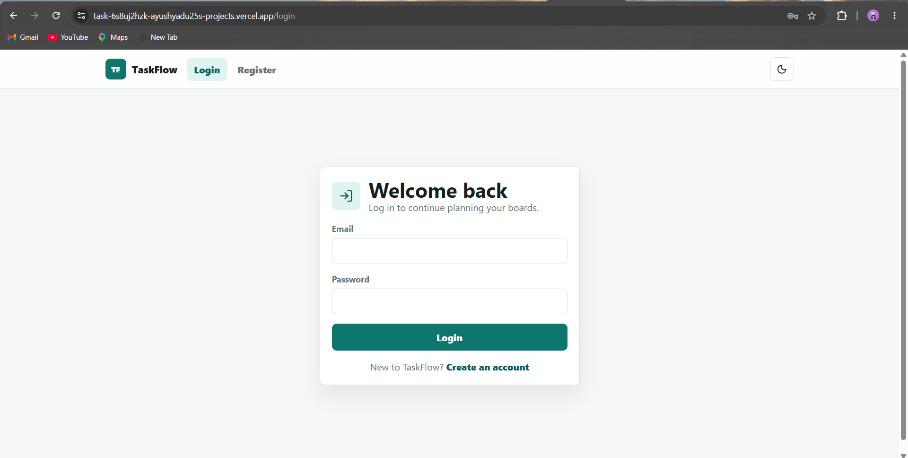
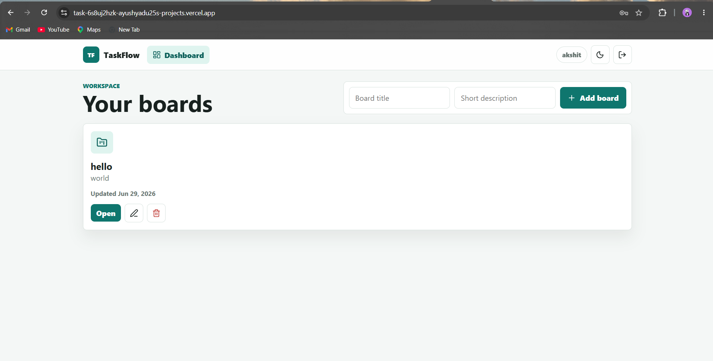
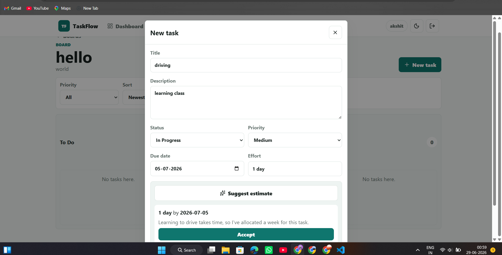
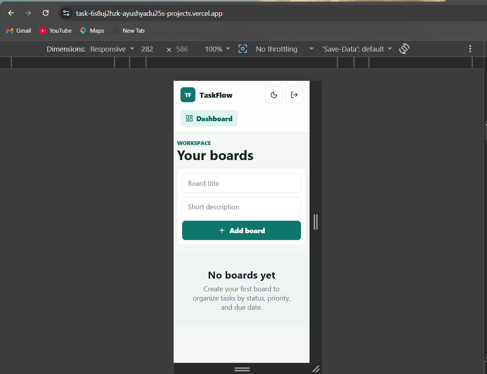

# TaskFlow

TaskFlow is a MERN task management app where users can register, login, create boards, and manage tasks by status, priority, due date, and effort estimate.

## Screenshots







## 🔗 Project Links

- **Frontend:** [TaskFlow Frontend](https://task-app-phi-flax.vercel.app)
- **Backend:** [TaskFlow Backend](https://task-app-o5mt.onrender.com)
- **GitHub Repository:** [ayushyadu25/task-app](https://github.com/ayushyadu25/task-app)


## Tech Stack

Frontend:
- React.js
- Vite
- React Router
- Axios
- CSS Modules

Backend:
- Node.js
- Express.js
- JWT Authentication
- Zod Validation

Database:
- MongoDB Atlas
- Mongoose

AI / LLM:
- Gemini API

Gemini was used because it is fast, simple to integrate, and useful for generating task effort and due-date suggestions.

## Local Setup

Clone the project:

```bash
git clone <repo-link>
cd taskProject
